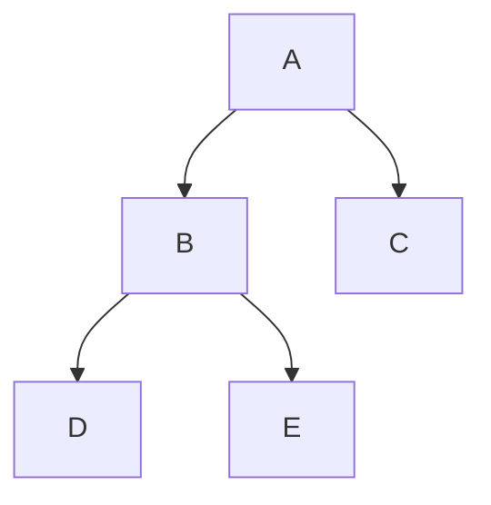

# 平台搭建指南

本文档按低代码智能体平台的通用能力编写，适用于扣子/Coze、文心智能体平台、腾讯元器、Dify 等类似平台。具体按钮名称可能不同。

## 1. 平台选择建议

优先选择同时支持以下能力的平台：

- 知识库上传
- 工作流编排
- 多轮对话
- 变量或表单
- 插件/API 调用
- 分享链接或二维码发布

首版推荐按这个优先级选择：

| 优先级 | 平台方向 | 适合情况 | 选择理由 |
|---|---|---|---|
| 1 | Dify | 小组希望把工作流、知识库和变量配置做得更清楚 | 知识库、工作流、变量、调试链路比较适合课程原型 |
| 2 | 腾讯元器 | 老师希望在微信生态或国内平台里演示 | 分享和展示门槛低，适合课堂传播 |
| 3 | 文心智能体平台 | 学校或老师更熟悉百度生态 | 国内平台，上手门槛较低 |
| 4 | Coze | 想快速做一个可聊天、可发布的原型 | 配置体验直观，适合快速演示 |

如果平台功能不完全一致，以“能上传知识库、能写系统提示词、能做分支流程、能分享测试链接”为最低标准。

本项目建议先按“一主一备”推进：

| 路线 | 平台 | 适用条件 | 迁移方式 |
|---|---|---|---|
| 主方案 | Dify | 平台可自由选择，重视工作流调试和知识库管理 | 直接使用本文档的字段、变量和节点 I/O |
| 备用方案 | 腾讯元器 / 文心智能体 / Coze | 老师要求从 aigc.cn 或国内平台选择 | 保留同一套提示词和知识库，把工作流压缩成平台支持的节点或单一主提示词 |

## 2. 创建智能体

基础信息建议：

- 名称：数据结构学习陪练台
- 简介：面向数据结构课程的智能学习助手，支持知识点讲解、题目拆解、过程可视化、代码纠错和小测反馈。
- 开场白：你好，我是数据结构学习陪练台。你可以问我链表、栈、队列、二叉树、图遍历相关问题，也可以把题目或代码发给我，我会帮你一步步分析。

建议快捷问题：

- 栈和队列有什么区别？
- 帮我用队列解释二叉树层序遍历。
- 这道链表题应该怎么拆？
- 帮我看看这段代码为什么遍历链表出错。
- 给我出 3 道二叉树小测题。

平台字段建议直接按下表填写：

| 字段 | 推荐填写 | 说明 |
|---|---|---|
| 应用名称 | 数据结构学习陪练台 | 用于老师和同学识别项目 |
| 应用类型 | 聊天助手 / 工作流助手 / Agent 应用 | 选平台里最接近“知识库问答 + 工作流”的类型 |
| 简介 | 面向数据结构课程的智能学习助手，支持知识点讲解、题目拆解、过程可视化、代码诊断和小测反馈。 | 不要写得像通用聊天机器人 |
| 开场白 | 你好，我是数据结构学习陪练台。你可以问我栈、队列、链表、二叉树、图遍历相关问题，也可以把题目或代码发给我，我会帮你一步步分析。 | 引导学生直接提课程问题 |
| 模型 | 平台默认较强模型；若可选，优先选推理能力稳定的模型 | 概念和代码诊断都需要稳定性 |
| 温度 | 0.2-0.4 | 课程答疑要稳，不宜太发散 |
| 最大输出长度 | 1500-2500 tokens 或平台中等偏长档 | 避免步骤表、代码诊断被截断 |
| 上下文轮数 | 8-10 轮 | 支持学生连续追问 |
| 知识库 | 数据结构课程知识库 | 首批上传 `04-knowledge-base-seed.md` |
| 工具/API | 首版可关闭；后续再接代码沙箱或判题接口 | 先保证静态诊断稳定 |
| 发布范围 | 小组私密测试，再给老师链接 | 避免未测试版本公开 |
| 失败兜底 | 这个问题课程资料中暂未覆盖，我可以先基于通用数据结构知识说明，也建议你补充 PPT 页码或题目上下文。 | 防止模型硬编 |

## 3. 配置知识库

知识库名称：

- 数据结构课程知识库

首批上传内容：

- 老师 PPT 或讲义
- 课程大纲
- 典型例题
- 实验指导书
- 常见错题
- 数据结构代码模板

知识库分组建议：

- 01-基础概念
- 02-栈与队列
- 03-链表
- 04-树与二叉树
- 05-图
- 06-排序与查找
- 07-实验与代码模板
- 08-常见错误

知识库回答要求：

- 优先引用课程材料。
- 如果课程材料没有覆盖，要明确说明“课程资料中未直接提到，我基于通用数据结构知识补充说明”。
- 回答要面向初学者，不要直接堆术语。

## 4. 设计工作流

推荐主工作流：

```text
用户输入
  -> 问题分类
  -> 分支处理
      -> 知识点讲解
      -> 题目拆解
      -> 过程可视化
      -> 代码诊断
      -> 小测复习
  -> 生成结构化回答
  -> 询问是否继续练习
```

问题分类规则：

- 出现“是什么、区别、复杂度、原理”：知识点讲解。
- 出现“题目、怎么做、思路”：题目拆解。
- 出现“过程、一步步、画图、演示”：过程可视化。
- 出现代码块、报错、运行结果不对：代码诊断。
- 出现“复习、出题、测试、掌握”：小测复习。

工作流节点建议按下面的输入输出契约配置：

| 节点 | 输入 | 处理 | 输出 | 分支条件 |
|---|---|---|---|---|
| 1. 问题分类 | `raw_query`、最近对话摘要 | 判断意图、主题、是否含代码、是否需要知识库、是否需要可视化 | `intent`、`topic`、`contains_code`、`need_kb`、`need_visualization`、`confidence` | 置信度低于 0.55 时先追问 1 个澄清问题 |
| 2. 知识库检索 | `raw_query`、`topic`、`intent` | 从课程知识库检索 Top 3-5 条内容 | `kb_hits`、`source_titles`、`hit_score`、`hit_flag` | `hit_flag=false` 时走通用知识补充分支 |
| 3. 分支处理 | `intent`、`raw_query`、`kb_hits` | 调用对应提示词模板 | `draft_answer` | 知识讲解 / 题目拆解 / 过程可视化 / 代码诊断 / 小测复习 / 超出范围 |
| 4. 最终回答整理 | `draft_answer`、`source_titles`、`hit_flag` | 统一格式、补来源声明、补追问或练习 | `final_answer` | 无 |
| 5. 记录与测试 | `raw_query`、`final_answer`、用户反馈 | 记录失败样例和薄弱主题 | `test_log`、`improvement_note` | 演示阶段可手动记录 |

### 可复制节点配置

#### 节点 1：问题分类

```text
节点名称：问题分类
输入变量：raw_query
输出变量：intent, topic, need_kb, need_visualization, contains_code, confidence

提示词：
请判断用户输入属于哪一类，并只输出 JSON。

类别只能从以下值选择：
知识点讲解、题目拆解、过程可视化、代码诊断、小测复习、超出范围

主题只能从以下值选择：
栈、队列、链表、二叉树、图遍历、排序与查找、未知

输出 JSON 格式：
{
  "intent": "知识点讲解",
  "topic": "栈",
  "need_kb": true,
  "need_visualization": false,
  "contains_code": false,
  "confidence": 0.86
}

用户输入：
{{raw_query}}
```

#### 节点 2：知识库检索

```text
节点名称：课程知识库检索
输入变量：raw_query, topic, intent
知识库：数据结构课程知识库
检索数量：Top 3-5
输出变量：kb_hits, source_titles, hit_flag

检索问题：
{{raw_query}}

检索过滤建议：
- topic 不为“未知”时，优先检索对应章节。
- intent 为“代码诊断”时，优先检索常见错误库和代码模板。
- intent 为“过程可视化”时，优先检索操作步骤、遍历过程和例题。
```

#### 节点 3：分支处理

```text
节点名称：分支处理
输入变量：intent, raw_query, kb_hits, hit_flag
输出变量：draft_answer

分支条件：
- intent == "知识点讲解" -> 知识讲解 Agent
- intent == "题目拆解" -> 题目理解 Agent
- intent == "过程可视化" -> 可视化 Agent
- intent == "代码诊断" or contains_code == true -> 代码诊断 Agent
- intent == "小测复习" -> 小测复习 Agent
- intent == "超出范围" -> 礼貌拒答并引导回数据结构
- hit_flag == false -> 必须加入“课程资料中未直接提到，我基于通用数据结构知识补充说明”
```

#### 节点 4：最终整理

```text
节点名称：最终回答整理
输入变量：draft_answer, source_titles, hit_flag
输出变量：final_answer

提示词：
请把草稿整理成面向学生的最终回答。
要求：
1. 开头先给一句结论。
2. 中间按“解释 / 步骤或示例 / 易错点 / 小练习”组织。
3. 如果 hit_flag 为 true，末尾写“来源：课程知识库相关材料”，并列出 source_titles。
4. 如果 hit_flag 为 false，明确说明“课程资料中未直接提到，我基于通用数据结构知识补充说明”。
5. 不输出内部分类、节点判断或调试信息。

草稿：
{{draft_answer}}
```

最终回答固定结构建议：

```text
结论：
解释：
步骤或示例：
易错点：
小练习或追问：
来源说明：
```

如果是代码诊断，固定结构改为：

```text
代码意图：
主要问题：
错误原因：
最小修改建议：
边界测试：
复杂度提醒：
```

## 5. 配置变量

建议设置这些变量：

- `student_level`：初学 / 复习 / 冲刺
- `language`：C / C++ / Java / Python
- `topic`：栈 / 队列 / 链表 / 二叉树 / 图
- `difficulty`：基础 / 中等 / 提高
- `answer_style`：简洁 / 详细 / 面试风格
- `need_visualization`：是 / 否

变量默认值建议：

| 变量名 | 默认值 | 推荐用途 |
|---|---|---|
| `student_level` | 初学 | 控制解释深度 |
| `programming_language` | C++ | 控制代码示例语言 |
| `topic` | 自动识别 | 用于知识库检索和分支 |
| `difficulty` | 基础 | 控制小测难度 |
| `answer_style` | 详细 | 演示时更容易看出教学价值 |
| `need_visualization` | 是 | 数据结构课程优先展示过程 |
| `source_policy` | 课程资料优先 | 知识库命中时必须说明依据 |

## 6. 子 Agent 或子流程设计

如果平台支持多 Agent 或多工作流，可以拆成 5 个子流程：

1. 题目理解流程
2. 知识讲解流程
3. 可视化流程
4. 代码诊断流程
5. 小测复习流程

如果平台不支持多 Agent，也可以在一个主提示词里用“角色分工”模拟。

## 7. 可视化实现方式

首版不要追求复杂动画。建议先用三种方式：

1. 表格：展示每一步操作后的状态。
2. ASCII 图：展示链表、栈、队列变化。
3. Mermaid 图：展示树、图、流程。

示例：



如果平台不能渲染 Mermaid，就输出代码块，让用户复制到支持 Mermaid 的工具中查看。

## 8. 代码诊断边界

首版只做静态诊断，不做真实代码运行。

输出格式：

1. 这段代码想做什么。
2. 可能错误在哪里。
3. 为什么错。
4. 最小修改建议。
5. 需要重点测试的边界用例。

如果以后要接真实运行，可以考虑外部代码沙箱或 Judge0 一类服务。

## 9. 测试与发布

上线前准备 20-30 条测试问题，覆盖：

- 基础概念
- 题目拆解
- 可视化
- 代码错误
- 小测生成
- 超出范围问题

发布方式：

- 先用私密链接给小组成员测试。
- 再给老师演示。
- 最后视情况公开到平台或生成二维码。

发布前验收表：

| 检查项 | 通过标准 |
|---|---|
| 基础问答 | 5 个核心主题都能给出定义、操作、复杂度、易错点 |
| 知识库引用 | 知识库命中时能优先使用课程资料，不编造来源 |
| 未命中处理 | 明确说明“课程资料中未直接提到” |
| 题目拆解 | 至少包含考点、思路、边界条件 |
| 过程可视化 | 能输出表格、ASCII 图或 Mermaid 代码块 |
| 代码诊断 | 给最小修改建议，而不是整段代写 |
| 小测复习 | 能稳定生成 3 道题、答案和解析 |
| 超出范围 | 能礼貌拒绝并引导回数据结构 |
| 演示稳定性 | 按 `06-demo-script.md` 连续演示无明显跑偏 |

## 10. 迭代方向

第一阶段：知识库问答 + 题目拆解。

第二阶段：过程可视化 + 小测。

第三阶段：代码诊断 + 错题记录。

第四阶段：接入代码运行或课程系统。
