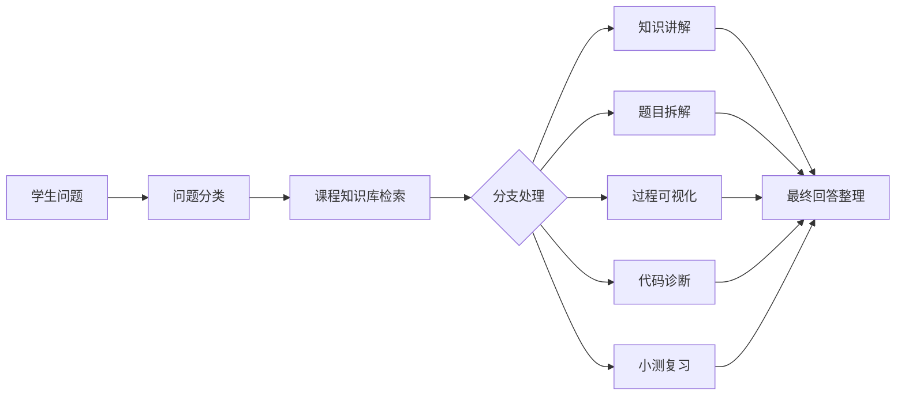

# 展示脚本

这份脚本适合在课堂、组会或给老师演示时使用。

建议演示时长：3-5 分钟。重点不是把所有功能讲完，而是让老师看到“课程知识库 + 题目拆解 + 可视化 + 代码诊断 + 小测”的闭环。

## 1. 开场介绍

我们想做的是一个“数据结构学习陪练台”。它不是普通聊天机器人，而是面向数据结构课程的学习智能体。

它主要解决四个问题：

- 学生看不懂概念。
- 学生看不懂结构变化过程。
- 学生会写代码但不知道哪里错。
- 学生复习时不知道自己薄弱点在哪里。

## 2. 展示主流程

建议先打开 `prototype.html`，再展示平台里的智能体链接。这样即使平台网络不稳定，也能先让老师看到完整交互形态。

### 第一步：知识点讲解

输入：

```text
栈和队列有什么区别？用简单例子解释。
```

讲解重点：

- 展示智能体能解释基础概念。
- 注意它不是只背定义，而是会举例。

### 第二步：过程可视化

输入：

```text
树是 A 的左孩子 B、右孩子 C，B 的左孩子 D、右孩子 E。请用队列一步步解释层序遍历。
```

讲解重点：

- 展示智能体能识别二叉树层序遍历。
- 展示队列状态变化。
- 展示最终遍历结果。
- 强调这不是只给答案，而是把“为什么用队列”讲清楚。

### 第三步：代码诊断

输入：

```text
下面这段删除链表节点的代码有什么问题？

while (p != NULL) {
    if (p->data == x) {
        p = p->next;
    }
}
```

讲解重点：

- 展示智能体能理解代码意图。
- 展示它能指出逻辑错误。
- 展示它会给最小修改建议，而不是直接重写全部代码。

### 第四步：小测反馈

输入：

```text
我刚学完二叉树遍历，给我出三道小题测一下。
```

讲解重点：

- 展示智能体能生成分层小测。
- 展示它可以用于课后复习。

## 3. 项目架构讲法

可以这样向老师解释：

我们的智能体分成五个能力模块：

1. 题目理解模块：判断题目考什么。
2. 知识讲解模块：基于课程资料解释概念。
3. 可视化模块：展示数据结构变化过程。
4. 代码诊断模块：定位学生代码错误。
5. 小测复习模块：根据问题生成练习和复习建议。

平台上如果支持工作流，我们就把它们拆成不同节点；如果平台不支持多 Agent，就先用一个主提示词模拟这些角色。

可以配合这张流程讲：



## 4. 老师追问时的回答

### 如果老师问：和普通 ChatGPT 有什么区别？

可以回答：

普通 ChatGPT 是通用问答，我们这个项目会优先接课程知识库，并把数据结构学习拆成固定流程：先判断问题类型，再查课程资料，再输出步骤图、代码诊断或小测。它更像一个课程助教，而不是泛泛聊天。

### 如果老师问：怎么保证准确？

可以回答：

第一，优先使用老师 PPT、讲义和实验指导作为知识库。第二，知识库没有覆盖时会明确说明是通用知识补充。第三，我们准备了测试用例矩阵，会用固定题反复测试，记录失败原因再改提示词或补资料。

### 如果老师问：能不能运行代码？

可以回答：

首版先做静态诊断，不承诺真实运行代码。它会判断代码意图、指出逻辑问题、给最小修改建议和边界测试。后续如果老师希望扩展，可以接代码沙箱或在线判题接口。

### 如果现场回答跑偏怎么办？

可以回答：

这正好是测试阶段需要记录的问题。我们会把跑偏样例加入测试集，判断是知识库缺内容、提示词约束不够，还是工作流分类不准，然后做下一轮优化。

## 5. 结尾说明

首版我们不追求做成完整在线判题系统，而是先做出一个能用于课堂演示和课后辅导的原型。

后续可以继续扩展：

- 接入代码运行沙箱。
- 增加错题本和学习画像。
- 接入更多课程资料。
- 扩展到排序、查找、哈希表、堆等章节。

## 6. 给老师的一句话

老师，我们想先做一个“数据结构学习陪练台”的最小可行版本，重点完成知识库问答、题目拆解、过程可视化和代码诊断。首版先覆盖栈、队列、链表、二叉树和图遍历，保证能快速演示，也方便后续继续扩展。

## 7. 你的个人分工说法

如果老师问你想负责什么，可以这样说：

```text
我想先参与方案设计、提示词配置、知识库整理和测试优化。我已经先整理了一个材料包和本地演示原型，后续可以继续把老师的 PPT、实验题和作业题整理进知识库，再配合小组把智能体搭到平台上。
```
